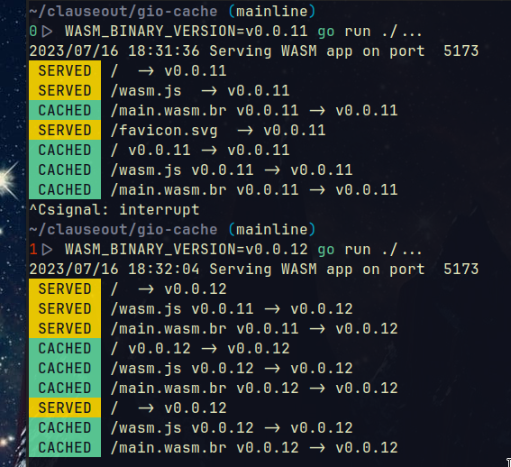
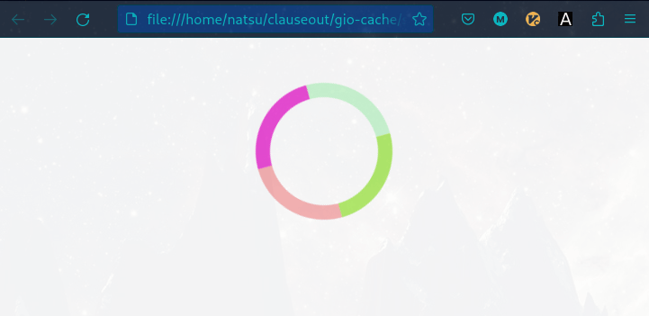
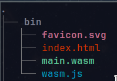

# [gio ui](https://gioui.org/) caching mechanism

### gio-cache serves 3 main purposes

1. Caches your WASM binary in a users browser based on a semantic version in the ETag


2. Shows a simple css spinner while your binary is being loaded & initialized in the browser


3. Compresses the main.wasm using [brotli](https://github.com/google/brotli) & serves the compressed version

# Usage
- place your wasm binary under this project directory in the bin dir
    - 
- `gio-cache` will fail fast if you don't set the environment variable `WASM_BINARY_VERSION`
    - this prevents you from accidentally deploying your app without a version (which results in some heavy network traffic)
- build the binary
```
make
```
- override any static files for your loading screen
```
make setup
```
- serve the app
```
WASM_BINARY_VERSION=v0.0.3 ./gio-cache
```

# Testing
### unit tests
```
go test ./...
```

### using curl
- run the server
```
WASM_BINARY_VERSION=v0.0.1 go run ./...
```
- check you can download file with correct size
```
curl -sH 'Accept-encoding: gzip' http://127.0.0.1:5173/main.wasm -v -O 
```
- you should then get a 304 if you request the same version
```
curl -sH 'Accept-encoding: gzip' -H 'If-None-Match: v0.0.1' http://127.0.0.1:5173/main.wasm -v -O 
```
- TODO convert these to go tests

### in browser
- finally the best way is to request the resources in a browser
